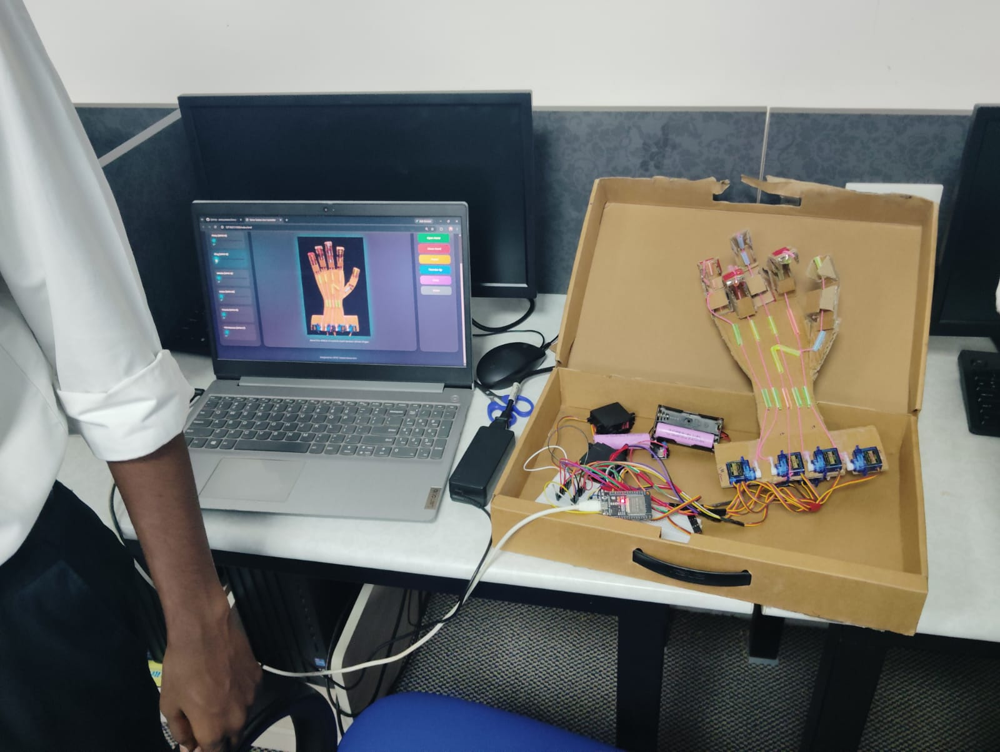
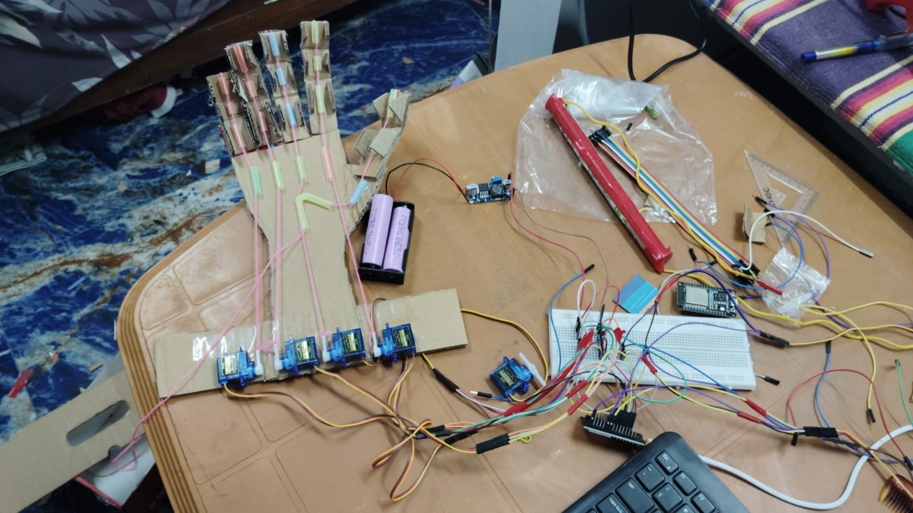
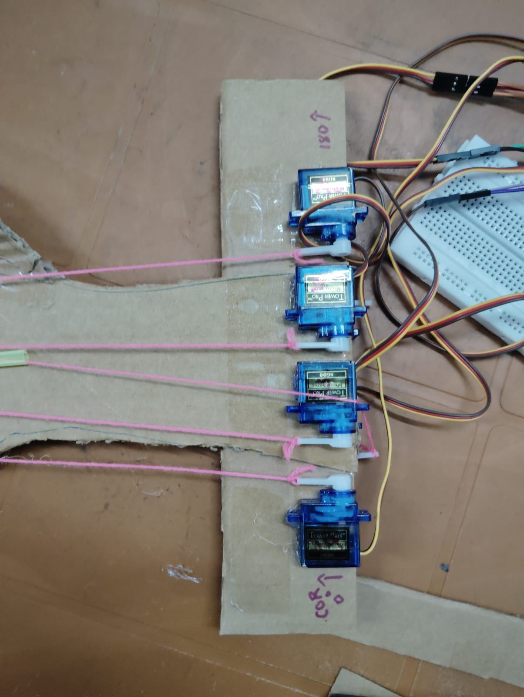
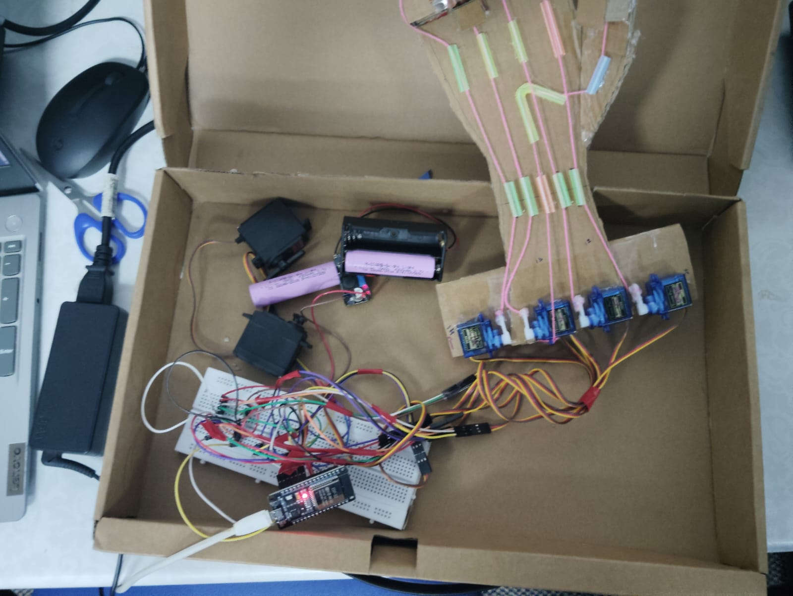
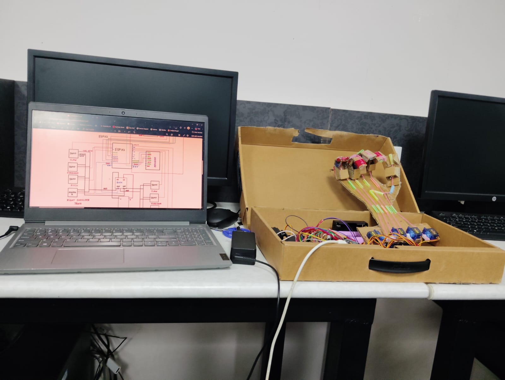

# ESP32 Wi-Fi Tendon-Driven Robotic Hand

A low-cost tendon-driven robotic hand built around an **ESP32**, six servo motors, and a browser-based wireless control interface.

The system allows each finger to be controlled independently over Wi-Fi, while also providing preset gestures such as **Open Hand, Close Hand, Peace, Thumbs Up, and Rock**.

The project combines **mechanical prototyping, tendon-based actuation, embedded programming, wireless communication, and web development** into a single working robotic system.



---

## Overview

The goal of this project was to build a functional robotic hand using inexpensive and easily available components, while keeping the control system simple enough to operate from a laptop or smartphone.

Instead of placing a motor at each finger joint, the hand uses a **tendon-driven mechanism**. Servo motors pull tendons routed along the fingers, producing the required finger movement.

The ESP32 acts as the central controller and hosts the control interface over Wi-Fi.


## Features

* Wi-Fi-based control using an ESP32
* Control from laptops, tablets, and smartphones
* Individual finger control
* Six-servo tendon-driven actuation
* Preset gesture controls:

  * Open Hand
  * Close Hand
  * Peace
  * Thumbs Up
  * Rock
* Browser-based control dashboard
* Real-time servo control
* Battery-powered operation
* No Bluetooth required

---

## Mechanical Design

The robotic hand uses a **tendon-driven architecture**.

Each servo is connected to a tendon routed along the corresponding finger. Rotating the servo pulls the tendon, causing the finger mechanism to bend.

The prototype was constructed using a combination of:

* Cardboard structural components
* Tendon threads
* Small guide tubes
* Servo motors
* A 3D-printed hand structure
* Adhesive and improvised mechanical supports



### Tendon Mechanism

The tendons are routed along the fingers using small guide sections to maintain alignment.

```text
Servo rotation
      ↓
Tendon is pulled
      ↓
Finger bends
      ↓
Robotic hand changes pose
```



The mechanical design went through multiple iterations while experimenting with tendon routing, servo placement, tension, and alignment.

---

## Electronics

The ESP32 is responsible for receiving commands and controlling the servo motors.

The servos are powered through an external supply rather than drawing their operating current directly from the ESP32.

### Main Components

| Component                  | Quantity |
| -------------------------- | -------: |
| ESP32 DevKit V1            |        1 |
| SG90 Servo Motors          |        4 |
| MG996R Servo Motors        |        2 |
| External 5–6V Servo Supply |        1 |
| Tendon-driven robotic hand |        1 |
| Wi-Fi enabled device       |        1 |



---

## Servo Mapping

| Finger / Function | GPIO |
| ----------------- | ---: |
| Pinky             |   14 |
| Ring              |   13 |
| Middle            |   12 |
| Index             |   26 |
| Thumb             |   19 |
| Fist Release      |   27 |

The exact servo angles are configurable in the firmware and can be tuned according to the mechanical position and tendon tension.

---

## Software Architecture

The control system is divided into two main parts.

### ESP32 Firmware

The ESP32 runs a lightweight HTTP server and receives servo commands through HTTP requests.

For example:

```text
/servo?pin=14&angle=90
```

The ESP32 parses the request and sets the corresponding servo to the requested angle.

### Web Dashboard

The browser-based interface provides:

* Individual finger controls
* Gesture presets
* Servo controls
* ESP32 connection configuration
* Responsive controls suitable for laptops and mobile devices



---

## Gesture Presets

The dashboard includes predefined poses that control multiple servos as a coordinated movement.

### Open Hand

Moves the fingers toward their open positions.

### Close Hand

Coordinates the servos to form a closed fist.

### Peace

Positions the index and middle fingers while keeping the remaining fingers retracted.

### Thumbs Up

Raises the thumb while keeping the other fingers closed.

### Rock

Produces the corresponding finger configuration using coordinated servo movement.

---

## Project Structure

```text
RobotHand/
│
├── images/
│   ├── final.jpg
│   ├── prototype.jpg
│   ├── tendon-mechanism.jpg
│   ├── electronics.jpg
│   └── dashboard.jpg
│
├── index.html
├── style.css
├── script.js
└── expo.ino
```

---

## Quick Start

### 1. Upload the Firmware

Open `expo.ino` in the Arduino IDE and upload it to the ESP32.

Update the Wi-Fi credentials in the firmware before uploading.

### 2. Connect the Hardware

Connect the six servos according to the GPIO mapping above.

Use an appropriate external supply for the servos and ensure that the ESP32 and servo power system share a common ground.

### 3. Power the System

Power the ESP32 and the external servo supply.

Once connected to the network, the ESP32 will obtain an IP address.

### 4. Open the Control Dashboard

Open `index.html` in a browser using a local development server such as **Live Server**.

Enter the ESP32's IP address if required.

### 5. Control the Hand

Use the dashboard to control individual servos or trigger the preset gestures.

---

## Development Process

This project was developed through physical prototyping rather than starting from a finished robotic mechanism.

The development process involved experimenting with:

* Servo placement
* Tendon routing
* Finger movement
* Tendon tension
* Mechanical alignment
* Power distribution
* ESP32 servo control
* Wireless communication
* Browser-based control


The physical prototype was intentionally built using readily available materials, making it possible to iterate quickly without specialized manufacturing equipment.

---

## Challenges

### Tendon Alignment

Small changes in tendon position can significantly affect finger movement. The tendons therefore had to be routed carefully to maintain a consistent pulling direction.

### Servo Positioning

The starting position and rotation range of each servo had to be tuned according to the mechanical geometry of the hand.

### Power Requirements

Multiple servos can draw significantly more current than an ESP32 can provide directly, so the servo power system was separated from the ESP32 supply.

### Coordinated Motion

Preset gestures require multiple servos to move to appropriate positions at the same time.

### Mechanical Repeatability

Because the prototype uses a lightweight and partially improvised mechanical structure, tendon tension, friction, and alignment can affect repeatability.

---

## Limitations

The current prototype uses **open-loop servo positioning**, meaning that the system commands servo angles without directly measuring the resulting finger position.

As a result, the exact finger position can vary due to:

* Tendon tension
* Mechanical friction
* Servo tolerances
* Structural flexibility
* Small alignment differences

The current version is therefore intended primarily as a **functional prototype and robotics experiment**.

---

## Technologies Used

### Hardware

* ESP32 DevKit V1
* SG90 servo motors
* MG996R servo motors
* Tendon-driven mechanical system
* External servo power supply

### Firmware

* Arduino IDE
* C/C++
* ESP32Servo
* ESP32WebServer

### Frontend

* HTML5
* CSS3
* JavaScript

### Communication

* Wi-Fi
* HTTP

---

## Future Improvements

* Motion recording and playback
* Camera-based hand tracking
* Closed-loop finger position control
* Servo calibration tools
* Smoother gesture transitions
* OTA firmware updates
* Improved mechanical tendon routing
* Compact electronics enclosure
* Progressive Web App support
* Computer-vision-based gesture recognition

---

## What I Learned

This project was an exploration of how **mechanical systems, electronics, firmware, networking, and software interfaces** can be combined into one working robotic system.

Some of the most valuable lessons came from the physical problems rather than the code: tendon routing, servo positioning, power requirements, mechanical alignment, and the differences between an ideal design and a mechanism that actually works.

---

## Demonstration

A demonstration video can be added here in the future.

For now, the repository contains photographs showing the mechanical prototype, tendon mechanism, electronics, and integrated system.

---

## Author

**Akshaya Balan**

Built as an independent robotics project using the ESP32 platform.

---

## License

Add a license according to how you want others to use, modify, and distribute the project.

```
```
